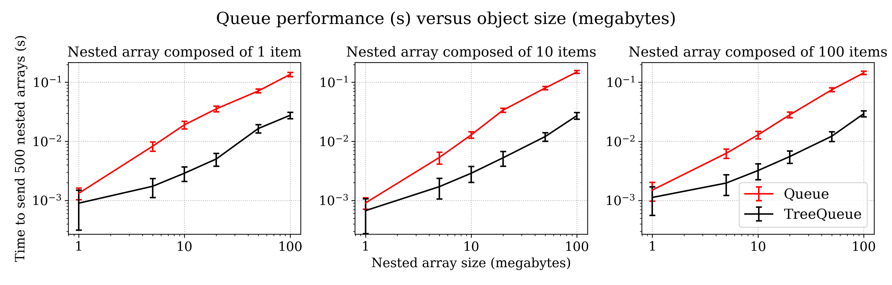

# treequeues

This package contains queues for transferring arrays and nested arrays between processes using
pytree and `multiprocessing.Array`s. Compared to the vanilla `multiprocessing.Queue`, this implementation
can reach speeds up to 10 times higher depending on the tree shape and size as well as the number of processes involved.


## Performance benchmark



## Installation
```
pip install git+https://github.com/thomashirtz/treequeues#egg=treequeues
```

# Usage example
```python
import numpy as np
from typing import NamedTuple
from multiprocessing import Process

from treequeues import TreeQueue


class ReadProcess(Process):
    def __init__(self, queue):
        super().__init__()
        self.queue = queue
      
    def run(self):
        print(self.source_queue.get())
        
        
class NestedArray(NamedTuple):
    item_1: np.ndarray
    item_2: np.ndarray
    item_3: np.ndarray

    
def get_nested_array():
    return NestedArray(
        item_1=np.random.random((4, )),
        item_2=np.random.random((1, )),
        item_3=np.random.random((3, 2, )),
    )
    

if __name__ == "__main__":
    nested_array = get_nested_array()
    # Initialize queue with the nested array 'nested_array' and with maximum 10 items
    queue = TreeQueue(nested_array=nested_array, maxsize=10)
    
    new_nested_array = get_nested_array()
    queue.put(new_nested_array)
    
    process = ReadProcess(queue=queue)
    process.start()
    process.join()
    
```
